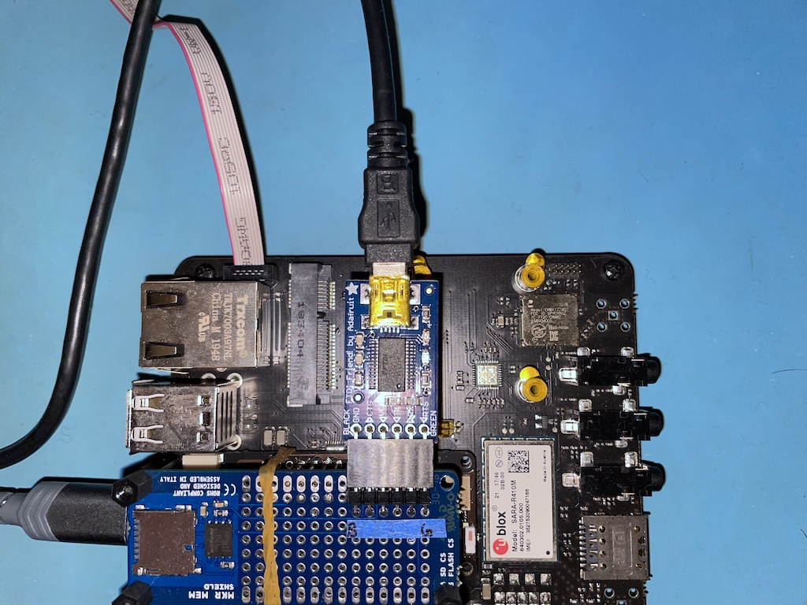

# ThreadDebug Test Pass
This README documents the manual steps that I conduct in GDB when running a test pass on the [ArduinoCore-mbed ThreadDebug library](https://github.com/arduino/ArduinoCore-mbed/tree/master/libraries/ThreadDebug). This repository also contains the source code for the [Test sketch](ThreadDebug_TestPass.ino) that I run on the Arduino device while running through the steps in this test pass.


## Verify ThreadDebug sample
* Use the Arduino IDE to open the ThreadDebug.ino sample included with the ArduinoCore-mbed based board packages.
* Build this sample and deploy to device.
  * Under ```ArduinoIDE/Preferences...``` check the ```compile``` box of the ```Show verbose output during``` setting so that the next step will work.
  * The Arduino IDE's build output will now indicate the **temp** output folder where the .elf can be found. Take note of this location.
  * The JTAG/SWD port for connecting the JLink debugger can be found on top of the development board, next to the Ethernet jack as seen in the following photo: 
  * Can start JLink to debug the Portenta H7 with the following command on my machine: ```jh7```
  * Open another Terminal window and ``cd`` into the temp folder containing the generated .elf binary.
  * From this Terminal window, we can run GDB against the recently opened JLink connection using this command on my machine: ```dh7 jlink```
  * The GDB ```load``` command can be used to load the binary into the Portenta H7.
  * Can ``quit`` this instance of GDB and use CTRL+C in the JLink window to exit it as well.
* Connect to ThreadDebug with GDB by using this command on my machine: ```dh7 mri```
* ```continue``` from the initial stop in ```setup()```.
* Verify output being spewed as expected to GDB console.
* Press CTRL+C to break in.
* ```continue```
* Repeat the last 2 steps a few times to make sure that GDB always receives output when execution isn't halted and that it can always successfully halt the processor, even when spammed with output.
```console
$ dh7 mri
GNU gdb (GNU Arm Embedded Toolchain 9-2020-q4-major) 8.3.1.20191211-git
Copyright (C) 2019 Free Software Foundation, Inc.
License GPLv3+: GNU GPL version 3 or later <http://gnu.org/licenses/gpl.html>
This is free software: you are free to change and redistribute it.
There is NO WARRANTY, to the extent permitted by law.
Type "show copying" and "show warranty" for details.
This GDB was configured as "--host=x86_64-apple-darwin10 --target=arm-none-eabi".
Type "show configuration" for configuration details.
For bug reporting instructions, please see:
<http://www.gnu.org/software/gdb/bugs/>.
Find the GDB manual and other documentation resources online at:
    <http://www.gnu.org/software/gdb/documentation/>.

For help, type "help".
Type "apropos word" to search for commands related to "word"...
Reading symbols from ThreadDebug.ino.elf...
Remote debugging using /dev/tty.usbmodem11401
setup ()
    at /private/var/folders/wl/2v_qgl8952bcj6vvc5_hvhd80000gn/T/.arduinoIDE-unsaved2022101-22533-1m2t2in.yyayi/ThreadDebug/ThreadDebug.ino:27
27	}
(gdb) c
Continuing.
Iteration: 0
Iteration: 1
Iteration: 2
Iteration: 3
Iteration: 4
Iteration: 5
Iteration: 6
Iteration: 7
Iteration: 8
Iteration: 9
Iteration: 10
^CIteration:
Thread 3 received signal SIGINT, Interrupt.
0x08043ea2 in mriNewlib_SemihostWrite ()
(gdb) c
Continuing.
11
```


## Verify DEBUG_NO_BREAK_IN_SETUP functionality
* Run first iteration on ThreadDebug_TestPass.ino with ```DEBUG_NO_BREAK_IN_SETUP``` used as the second parameter to the ThreadDebug constructor.
```c++
ThreadDebug            threadDebug(&debugComm, DEBUG_NO_BREAK_IN_SETUP);
```
* Build the code and deploy to the Arduino device.
* Attach with GDB and look at the state of device and it should look something like:
```console
$ dh7 mri
GNU gdb (GNU Arm Embedded Toolchain 9-2020-q4-major) 8.3.1.20191211-git
Copyright (C) 2019 Free Software Foundation, Inc.
License GPLv3+: GNU GPL version 3 or later <http://gnu.org/licenses/gpl.html>
This is free software: you are free to change and redistribute it.
There is NO WARRANTY, to the extent permitted by law.
Type "show copying" and "show warranty" for details.
This GDB was configured as "--host=x86_64-apple-darwin10 --target=arm-none-eabi".
Type "show configuration" for configuration details.
For bug reporting instructions, please see:
<http://www.gnu.org/software/gdb/bugs/>.
Find the GDB manual and other documentation resources online at:
    <http://www.gnu.org/software/gdb/documentation/>.

For help, type "help".
Type "apropos word" to search for commands related to "word"...
Reading symbols from ThreadDebug_TestPass.ino.elf...
Remote debugging using /dev/tty.usbmodem11401
0x0804c818 in hal_critical_section_exit () at ./mbed-os/cmsis/CMSIS_5/CMSIS/TARGET_CORTEX_M/Include/cmsis_gcc.h:951
951	./mbed-os/cmsis/CMSIS_5/CMSIS/TARGET_CORTEX_M/Include/cmsis_gcc.h: No such file or directory.
(gdb) bt
#0  0x0804c818 in hal_critical_section_exit ()
    at ./mbed-os/cmsis/CMSIS_5/CMSIS/TARGET_CORTEX_M/Include/cmsis_gcc.h:951
#1  0x0804dda0 in core_util_critical_section_exit () at ./mbed-os/platform/source/mbed_critical.c:79
#2  0x0804d194 in mbed::CriticalSectionLock::~CriticalSectionLock (this=0x2400e7f4 <_main_stack+32660>,
    __in_chrg=<optimized out>) at ./mbed-os/platform/source/CriticalSectionLock.cpp:30
#3  0x0804a81e in mbed::TimerBase::elapsed_time (this=this@entry=0x24003eb8 <lowPowerTimer>)
    at /Users/username/depots/gcc-arm-none-eabi/install-native/arm-none-eabi/include/c++/9.3.1/chrono:331
#4  0x08046156 in millis () at /Users/username/Documents/Arduino/hardware/arduino/mbed/cores/arduino/wiring.cpp:44
#5  0x08045fe6 in arduino::Stream::timedPeek (this=this@entry=0x24002db8 <_UART1_>)
    at /Users/username/Documents/Arduino/hardware/arduino/mbed/cores/arduino/api/Stream.cpp:52
#6  0x0804600e in arduino::Stream::peekNextDigit (this=this@entry=0x24002db8 <_UART1_>, lookahead=<optimized out>,
    detectDecimal=detectDecimal@entry=false)
    at /Users/username/Documents/Arduino/hardware/arduino/mbed/cores/arduino/api/Stream.cpp:62
#7  0x08046066 in arduino::Stream::parseInt (this=0x24002db8 <_UART1_>,
    lookahead=lookahead@entry=arduino::SKIP_ALL, ignore=ignore@entry=1 '\001')
    at /Users/username/Documents/Arduino/hardware/arduino/mbed/cores/arduino/api/Stream.cpp:138
#8  0x08040512 in loop () at /Users/username/depots/ThreadDebug_TestPass/ThreadDebug_TestPass.ino:42
#9  0x080460de in main () at /Users/username/Documents/Arduino/hardware/arduino/mbed/cores/arduino/main.cpp:47
(gdb)
```
* Set the constructor parameter back to ```DEBUG_BREAK_IN_SETUP``` in the Arduino IDE to run the rest of the tests.
```c++
ThreadDebug            threadDebug(&debugComm, DEBUG_BREAK_IN_SETUP);
```
* Build and deploy this updated code to the Arduino device for running the rest of the tests.


## Verify Correct XML for Registers & Memory
ThreadDebug should expose XML dictating the register and memory layout of the device on which it is running.

There should be the expected r0-r12, sp, lr, pc, xpsr, s0-s32, and fpscr as seen below:
```
setup ()
    at /private/var/folders/wl/2v_qgl8952bcj6vvc5_hvhd80000gn/T/.arduinoIDE-unsaved2022931-92195-1f7bydq.iny/Test/Test.ino:23
23	void setup() {
(gdb) info all-reg
r0             0x2400e718          604038936
r1             0x0                 0
r2             0x0                 0
r3             0x0                 0
r4             0x0                 0
r5             0x0                 0
r6             0x0                 0
r7             0x0                 0
r8             0x0                 0
r9             0x0                 0
r10            0x0                 0
r11            0x0                 0
r12            0x80475b5           134510005
sp             0x2400e858          0x2400e858 <_main_stack+32760>
lr             0x80460e3           0x80460e3 <main()+34>
pc             0x80403ec           0x80403ec <setup()>
xpsr           0x61000000          1627389952
d0             0                   (raw 0x0000000000000000)
d1             0                   (raw 0x0000000000000000)
d2             0                   (raw 0x0000000000000000)
d3             0                   (raw 0x0000000000000000)
d4             0                   (raw 0x0000000000000000)
d5             0.0078125           (raw 0x3f80000000000000)
d6             2.0000005647887491  (raw 0x400000004bcdfe60)
d7             1.7790108226531607e-179 (raw 0x1ad274804dd693a4)
d8             0                   (raw 0x0000000000000000)
d9             0                   (raw 0x0000000000000000)
d10            0                   (raw 0x0000000000000000)
d11            0                   (raw 0x0000000000000000)
d12            0                   (raw 0x0000000000000000)
d13            0                   (raw 0x0000000000000000)
d14            0                   (raw 0x0000000000000000)
d15            -nan(0xfffff00000000) (raw 0xffffffff00000000)
fpscr          0x0                 0
s0             0                   (raw 0x00000000)
s1             0                   (raw 0x00000000)
s2             0                   (raw 0x00000000)
s3             0                   (raw 0x00000000)
s4             0                   (raw 0x00000000)
s5             0                   (raw 0x00000000)
s6             0                   (raw 0x00000000)
s7             0                   (raw 0x00000000)
s8             0                   (raw 0x00000000)
s9             0                   (raw 0x00000000)
s10            0                   (raw 0x00000000)
s11            1                   (raw 0x3f800000)
s12            27000000            (raw 0x4bcdfe60)
s13            2                   (raw 0x40000000)
s14            450000000           (raw 0x4dd693a4)
s15            8.70421802e-23      (raw 0x1ad27480)
s16            0                   (raw 0x00000000)
s17            0                   (raw 0x00000000)
s18            0                   (raw 0x00000000)
s19            0                   (raw 0x00000000)
s20            0                   (raw 0x00000000)
s21            0                   (raw 0x00000000)
s22            0                   (raw 0x00000000)
s23            0                   (raw 0x00000000)
s24            0                   (raw 0x00000000)
s25            0                   (raw 0x00000000)
s26            0                   (raw 0x00000000)
s27            0                   (raw 0x00000000)
s28            0                   (raw 0x00000000)
s29            0                   (raw 0x00000000)
s30            0                   (raw 0x00000000)
s31            -nan(0x7fffff)      (raw 0xffffffff)
```

The various RAM and FLASH locations should also be exposed as seen next:
```
(gdb) info mem
Using memory regions provided by the target.
Num Enb Low Addr   High Addr  Attrs
0   y  	0x00000000 0x00010000 rw nocache
1   y  	0x08000000 0x08200000 flash blocksize 0x20000 nocache
2   y  	0x10000000 0x10048000 rw nocache
3   y  	0x1ff00000 0x1ff20000 rw nocache
4   y  	0x20000000 0x20020000 rw nocache
5   y  	0x24000000 0x24080000 rw nocache
6   y  	0x30000000 0x30048000 rw nocache
7   y  	0x38000000 0x38010000 rw nocache
8   y  	0x38800000 0x38801000 rw nocache
9   y  	0x58020000 0x58022c00 rw nocache
10  y  	0x58024400 0x58025000 rw nocache
11  y  	0x58025400 0x58025c00 rw nocache
12  y  	0x58026000 0x58026800 rw nocache
13  y  	0x58027000 0x58027400 rw nocache
14  y  	0x60000000 0x60800000 rw nocache
15  y  	0x90000000 0xa0000000 flash blocksize 0x200 nocache
```


## Verify Bit Shift for Interrupt Priorities
The correct number of bits that the interrupt priority values should be shifted left on the Cortex-M7 in the Portenta H7 is **4**:
```
(gdb) p mriCortexMState.priorityBitShift
$1 = 4
```


## Verify Initial Threads
When the test binary starts, it should have 4 threads as seen below:
```
(gdb) info thread
  Id   Target Id                                        Frame
  1    Thread 603996076 ("rtx_timer" WaitingMessageGet) __svcMessageQueueGet (a4=<optimized out>,
    a3=<optimized out>, a2=<optimized out>, a1=<optimized out>)
    at ./mbed-os/cmsis/CMSIS_5/CMSIS/RTOS2/RTX/Source/rtx_msgqueue.c:723
  2    Thread 603996144 ("rtx_idle" Ready)              osRtxIdleThread (argument=0x0)
    at ./mbed-os/cmsis/device/rtos/source/mbed_rtx_handlers.c:51
* 3    Thread 603997984 ("main" Ready)                  setup ()
    at /private/var/folders/wl/2v_qgl8952bcj6vvc5_hvhd80000gn/T/.arduinoIDE-unsaved2022931-92195-1f7bydq.iny/Test/Test.ino:23
  4    Thread 604051672 ("USBevt" Ready)                mbed::Callback<void ()>::operator bool() const (
    this=0x24011864) at ./mbed-os/platform/include/platform/Callback.h:520
(gdb) thread apply all bt

Thread 4 (Thread 604051672):
#0  mbed::Callback<void ()>::operator bool() const (this=0x24011864) at ./mbed-os/platform/include/platform/Callback.h:520
#1  mbed::Callback<void ()>::call() const (this=0x24011864) at ./mbed-os/platform/include/platform/Callback.h:506
#2  mbed::Callback<void ()>::operator()() const (this=0x24011864) at ./mbed-os/platform/include/platform/Callback.h:515
#3  rtos::Thread::_thunk (thread_ptr=0x24011860) at ./mbed-os/rtos/source/Thread.cpp:340
#4  0x08047e0c in svcRtxThreadGetCount () at ./mbed-os/cmsis/CMSIS_5/CMSIS/RTOS2/RTX/Source/rtx_thread.c:1372
Backtrace stopped: previous frame identical to this frame (corrupt stack?)

Thread 3 (Thread 603997984):
#0  setup () at /private/var/folders/wl/2v_qgl8952bcj6vvc5_hvhd80000gn/T/.arduinoIDE-unsaved2022931-92195-1f7bydq.iny/Test/Test.ino:23
#1  0x080460e2 in main () at /Users/username/Documents/Arduino/hardware/arduino/mbed/cores/arduino/main.cpp:44

Thread 2 (Thread 603996144):
#0  osRtxIdleThread (argument=0x0) at ./mbed-os/cmsis/device/rtos/source/mbed_rtx_handlers.c:51
#1  0x08047e0c in svcRtxThreadGetCount () at ./mbed-os/cmsis/CMSIS_5/CMSIS/RTOS2/RTX/Source/rtx_thread.c:1372
Backtrace stopped: previous frame identical to this frame (corrupt stack?)

Thread 1 (Thread 603996076):
#0  __svcMessageQueueGet (a4=<optimized out>, a3=<optimized out>, a2=<optimized out>, a1=<optimized out>) at ./mbed-os/cmsis/CMSIS_5/CMSIS/RTOS2/RTX/Source/rtx_msgqueue.c:723
#1  osMessageQueueGet (mq_id=mq_id@entry=0x24003f28 <os_timer_mq_cb>, msg_ptr=0x24003fac <os_timer_thread_cb>, msg_ptr@entry=0x240046a8 <os_timer_thread_stack+752>, msg_prio=0x240046a8 <os_timer_thread_stack+752> "(?", msg_prio@entry=0x0, timeout=timeout@entry=4294967295) at ./mbed-os/cmsis/CMSIS_5/CMSIS/RTOS2/RTX/Source/rtx_msgqueue.c:882
#2  0x080489be in osRtxTimerThread (argument=0x24003f28 <os_timer_mq_cb>) at ./mbed-os/cmsis/CMSIS_5/CMSIS/RTOS2/RTX/Source/rtx_timer.c:159
#3  0x08047e0c in svcRtxThreadGetCount () at ./mbed-os/cmsis/CMSIS_5/CMSIS/RTOS2/RTX/Source/rtx_thread.c:1372
Backtrace stopped: previous frame identical to this frame (corrupt stack?)
```


## Verify GDB Generated Memory Faults are Handled Properly
Try to read and write from an invalid address like **0xFFFFFFF0** to verify that ThreadDebug/MRI catches the fact that a memory access initiated by GDB has led to a HardFault:
```
(gdb) set mem inaccessible-by-default off
(gdb) x/1wx 0xfffffff0
0xfffffff0:	Cannot access memory at address 0xfffffff0
(gdb) set var *(uint32_t*)0xfffffff0=0
Cannot access memory at address 0xfffffff0
(gdb) set mem inaccessible-by-default on
```


## Connect CoolTerm to Serial1
Need to connect CoolTerm to Serial1 on the Porenta H7 so that we can see the menu of test options exposed by the test binary and select which of the tests we want to run.

Can also use the TIO utility, found on HomeBrew. It is launched like this:
```console
tio -b 230400 /dev/tty.usbserial-A505C8GJ
```

* The FTDI adapter should be connected to the 0.1" header on the test jig as seen in the following photo: 
* Connect CoolTerm to the FTDI device at 230400 baud.


## Test Generated Hard Fault
Continue execution in GDB and then use CoolTerm to select ```1) Set registers to known values and crash.```

This test should generate a Hard Fault caused by a precise data access to address 0xFFFFFFF0 as seen below:
```
(gdb) c
Continuing.

**Hard Fault**
  Status Register: 0x40000000
    Forced
**Bus Fault**
  Status Register: 0x82
    Fault Address: 0xfffffff0
    Precise Data Access

Thread 3 received signal SIGSEGV, Segmentation fault.
0x08040666 in testContextWithCrash ()
```

The registers should have known values at this time, most ascending as seen in GDB session below:
```
(gdb) info all-reg
r0             0xfffffff0          -16
r1             0x1                 1
r2             0x2                 2
r3             0x3                 3
r4             0x4                 4
r5             0x5                 5
r6             0x6                 6
r7             0x7                 7
r8             0x8                 8
r9             0x9                 9
r10            0xa                 10
r11            0xb                 11
r12            0xc                 12
sp             0x2400e7f8          0x2400e7f8 <_main_stack+32664>
lr             0x80460e7           0x80460e7 <main()+38>
pc             0x8040666           0x8040666 <testContextWithCrash+198>
xpsr           0x810b0000          -2129985536
d0             0.0078125055733835325 (raw 0x3f800000bf800000)
d1             32.000007629394531  (raw 0x4040000040000000)
d2             2048.0004920959473  (raw 0x40a0000040800000)
d3             32768.007904052734  (raw 0x40e0000040c00000)
d4             262144.0634765625   (raw 0x4110000041000000)
d5             1048576.2543945312  (raw 0x4130000041200000)
d6             4194305.01953125    (raw 0x4150000041400000)
d7             16777220.0859375    (raw 0x4170000041600000)
d8             50331656.1875       (raw 0x4188000041800000)
d9             100663312.390625    (raw 0x4198000041900000)
d10            201326624.8125      (raw 0x41a8000041a00000)
d11            402653249.6875      (raw 0x41b8000041b00000)
d12            805306499.5         (raw 0x41c8000041c00000)
d13            1610612999.25       (raw 0x41d8000041d00000)
d14            3221225999          (raw 0x41e8000041e00000)
d15            6442451999          (raw 0x41f8000041f00000)
fpscr          0xb280008d          -1300234099
s0             -1                  (raw 0xbf800000)
s1             1                   (raw 0x3f800000)
s2             2                   (raw 0x40000000)
s3             3                   (raw 0x40400000)
s4             4                   (raw 0x40800000)
s5             5                   (raw 0x40a00000)
s6             6                   (raw 0x40c00000)
s7             7                   (raw 0x40e00000)
s8             8                   (raw 0x41000000)
s9             9                   (raw 0x41100000)
s10            10                  (raw 0x41200000)
s11            11                  (raw 0x41300000)
s12            12                  (raw 0x41400000)
s13            13                  (raw 0x41500000)
s14            14                  (raw 0x41600000)
s15            15                  (raw 0x41700000)
s16            16                  (raw 0x41800000)
s17            17                  (raw 0x41880000)
s18            18                  (raw 0x41900000)
s19            19                  (raw 0x41980000)
s20            20                  (raw 0x41a00000)
s21            21                  (raw 0x41a80000)
s22            22                  (raw 0x41b00000)
s23            23                  (raw 0x41b80000)
s24            24                  (raw 0x41c00000)
s25            25                  (raw 0x41c80000)
s26            26                  (raw 0x41d00000)
s27            27                  (raw 0x41d80000)
s28            28                  (raw 0x41e00000)
s29            29                  (raw 0x41e80000)
s30            30                  (raw 0x41f00000)
s31            31                  (raw 0x41f80000)
```

Once the register contents have been verified, we can skip over the crashing instruction and let the test continue executing:
```
(gdb) set var $pc=$pc+2
(gdb) c
Continuing.
```


## Test Generated Breakpoint
Use CoolTerm to select ```2) Set registers to known values and stop at hardcoded bkpt.```

This test should generate a debug trap caused by a hardcoded breakpoint in the test routine as seen below:
```
Thread 3 received signal SIGTRAP, Trace/breakpoint trap.
0x0804073a in testContextWithHardcodedBreakpoint ()
```

The registers should have known values at this time, most ascending as seen in GDB session below:
```
(gdb) info all-reg
r0             0x0                 0
r1             0x1                 1
r2             0x2                 2
r3             0x3                 3
r4             0x4                 4
r5             0x5                 5
r6             0x6                 6
r7             0x7                 7
r8             0x8                 8
r9             0x9                 9
r10            0xa                 10
r11            0xb                 11
r12            0xc                 12
sp             0x2400e7f8          0x2400e7f8 <_main_stack+32664>
lr             0x80460e7           0x80460e7 <main()+38>
pc             0x804073a           0x804073a <testContextWithHardcodedBreakpoint+194>
xpsr           0x810b0000          -2129985536
d0             0.0078125055733835325 (raw 0x3f800000bf800000)
d1             32.000007629394531  (raw 0x4040000040000000)
d2             2048.0004920959473  (raw 0x40a0000040800000)
d3             32768.007904052734  (raw 0x40e0000040c00000)
d4             262144.0634765625   (raw 0x4110000041000000)
d5             1048576.2543945312  (raw 0x4130000041200000)
d6             4194305.01953125    (raw 0x4150000041400000)
d7             16777220.0859375    (raw 0x4170000041600000)
d8             50331656.1875       (raw 0x4188000041800000)
d9             100663312.390625    (raw 0x4198000041900000)
d10            201326624.8125      (raw 0x41a8000041a00000)
d11            402653249.6875      (raw 0x41b8000041b00000)
d12            805306499.5         (raw 0x41c8000041c00000)
d13            1610612999.25       (raw 0x41d8000041d00000)
d14            3221225999          (raw 0x41e8000041e00000)
d15            6442451999          (raw 0x41f8000041f00000)
fpscr          0xb280008d          -1300234099
s0             -1                  (raw 0xbf800000)
s1             1                   (raw 0x3f800000)
s2             2                   (raw 0x40000000)
s3             3                   (raw 0x40400000)
s4             4                   (raw 0x40800000)
s5             5                   (raw 0x40a00000)
s6             6                   (raw 0x40c00000)
s7             7                   (raw 0x40e00000)
s8             8                   (raw 0x41000000)
s9             9                   (raw 0x41100000)
s10            10                  (raw 0x41200000)
s11            11                  (raw 0x41300000)
s12            12                  (raw 0x41400000)
s13            13                  (raw 0x41500000)
s14            14                  (raw 0x41600000)
s15            15                  (raw 0x41700000)
s16            16                  (raw 0x41800000)
s17            17                  (raw 0x41880000)
s18            18                  (raw 0x41900000)
s19            19                  (raw 0x41980000)
s20            20                  (raw 0x41a00000)
s21            21                  (raw 0x41a80000)
s22            22                  (raw 0x41b00000)
s23            23                  (raw 0x41b80000)
s24            24                  (raw 0x41c00000)
s25            25                  (raw 0x41c80000)
s26            26                  (raw 0x41d00000)
s27            27                  (raw 0x41d80000)
s28            28                  (raw 0x41e00000)
s29            29                  (raw 0x41e80000)
s30            30                  (raw 0x41f00000)
s31            31                  (raw 0x41f80000)
(gdb) bt
#0  0x0804073a in testContextWithHardcodedBreakpoint ()
#1  0x080460e6 in main () at /Users/username/Documents/Arduino/hardware/arduino/mbed/cores/arduino/main.cpp:47
```

Single step over the breakpoint exception as this should just cause ThreadDebug to soft step over the instruction and immediately trap on the next instruction from which we can continue execution:
```
(gdb) si
0x0804073c in testContextWithHardcodedBreakpoint ()
(gdb) c
Continuing.
```

Use CoolTerm to select ```2) Set registers to known values and stop at hardcoded bkpt``` again and then just issue a ```continue``` to let the test program resume execution. ThreadDebug will first single step over the hardcoded breakpoint and then resume execution.
```
Thread 3 received signal SIGTRAP, Trace/breakpoint trap.
0x0804073a in testContextWithHardcodedBreakpoint ()
(gdb) c
Continuing.
```


## Test Handler Mode Breakpoints and Thread Breakpoints
If the user attempts to set a breakpoint that would fire when the CPU is running in handler mode (ie. in an interrupt handler) then it should be ignored as ThreadDebug can only debug code that is running in thread mode.

The best way to test this scenario is to attempt setting a breakpoint on ```SysTick_Handler```, which is obviously an interrupt handler. At the same time set a breakpoint on the ```breakOnMe``` function to make sure that attempting to enter this function still breaks into GDB even though multiple SysTick_Handler breakpoints will have been hit and ignored.
```
^C
Thread 3 received signal SIGINT, Interrupt.
0x0804c820 in hal_critical_section_exit () at ./mbed-os/cmsis/CMSIS_5/CMSIS/TARGET_CORTEX_M/Include/cmsis_gcc.h:951
951	./mbed-os/cmsis/CMSIS_5/CMSIS/TARGET_CORTEX_M/Include/cmsis_gcc.h: No such file or directory.
(gdb) break SysTick_Handler
Breakpoint 1 at 0x804649e: file ./mbed-os/cmsis/CMSIS_5/CMSIS/RTOS2/RTX/Source/TOOLCHAIN_GCC/TARGET_RTOS_M4_M7/irq_cm4f.S, line 218.
(gdb) break breakOnMe
Breakpoint 2 at 0x804034c: file /private/var/folders/wl/2v_qgl8952bcj6vvc5_hvhd80000gn/T/.arduinoIDE-unsaved2022931-92195-1f7bydq.iny/Test/Test.ino, line 76.
(gdb) c
Continuing.
Note: automatically using hardware breakpoints for read-only addresses.
```

Use CoolTerm to select ```3) Call breakOnMe() to increment g_global``` and verify that the code stops at ```breakOnMe()```:
```
Thread 3 hit Breakpoint 2, breakOnMe ()
    at /private/var/folders/wl/2v_qgl8952bcj6vvc5_hvhd80000gn/T/.arduinoIDE-unsaved2022931-92195-1f7bydq.iny/Test/Test.ino:76
76	    g_global++;
(gdb) bt
#0  breakOnMe ()
    at /private/var/folders/wl/2v_qgl8952bcj6vvc5_hvhd80000gn/T/.arduinoIDE-unsaved2022931-92195-1f7bydq.iny/Test/Test.ino:76
#1  0x080460e6 in main () at /Users/username/Documents/Arduino/hardware/arduino/mbed/cores/arduino/main.cpp:47
(gdb) c
Continuing.
^C
Thread 3 received signal SIGINT, Interrupt.
```


## Test Handler Mode Breakpoints and Thread Watchpoints
The following tests are similar to the previous except that they make sure that watchpoints still work when debug events are ignored on handler mode code.

Start with a write watchpoint:
```
(gdb) delete
Delete all breakpoints? (y or n) y
(gdb) break SysTick_Handler
Breakpoint 3 at 0x804649e: file ./mbed-os/cmsis/CMSIS_5/CMSIS/RTOS2/RTX/Source/TOOLCHAIN_GCC/TARGET_RTOS_M4_M7/irq_cm4f.S, line 218.
(gdb) watch g_global
Hardware watchpoint 4: g_global
(gdb) c
Continuing.
```

Use CoolTerm to select ```3) Call breakOnMe() to increment g_global``` again and verify expected watchpoint is encountered:
```
Thread 3 hit Hardware watchpoint 4: g_global

Old value = 1
New value = 2
breakOnMe ()
    at /private/var/folders/wl/2v_qgl8952bcj6vvc5_hvhd80000gn/T/.arduinoIDE-unsaved2022931-92195-1f7bydq.iny/Test/Test.ino:78
78	}
```

Run the same test as above but for a read watchpoint:
```
(gdb) delete
Delete all breakpoints? (y or n) y
(gdb) break SysTick_Handler
Breakpoint 5 at 0x804649e: file ./mbed-os/cmsis/CMSIS_5/CMSIS/RTOS2/RTX/Source/TOOLCHAIN_GCC/TARGET_RTOS_M4_M7/irq_cm4f.S, line 218.
(gdb) rwatch g_global
Hardware read watchpoint 6: g_global
(gdb) c
Continuing.

Thread 3 hit Hardware read watchpoint 6: g_global

Value = 3
breakOnMe ()
    at /private/var/folders/wl/2v_qgl8952bcj6vvc5_hvhd80000gn/T/.arduinoIDE-unsaved2022931-92195-1f7bydq.iny/Test/Test.ino:78
78	}
(gdb) bt
#0  breakOnMe ()
    at /private/var/folders/wl/2v_qgl8952bcj6vvc5_hvhd80000gn/T/.arduinoIDE-unsaved2022931-92195-1f7bydq.iny/Test/Test.ino:78
#1  0x080460e6 in main () at /Users/username/Documents/Arduino/hardware/arduino/mbed/cores/arduino/main.cpp:47
(gdb) delete
Delete all breakpoints? (y or n) y
(gdb) c
Continuing.
```


## Test Threaded Single Stepping at Normal Priority
Normally when single stepping through a thread with GDB, the other threads will continue to execute normally. This test verifies that happens when two threads running at normal priority are both logging output to Serial1.

Use CoolTerm to select ```4) Run 2 threads at normal priority```

Once the 2 threads have started logging text to CoolTerm, we can break in and perform some single stepping tests on the second test thread. In CoolTerm, output from both Thread1 and Thread2 should be seen while performing this single stepping.
```
^C[New Thread 603986088]
[New Thread 603986156]

Thread 3 received signal SIGINT, Interrupt.
0x0804c820 in hal_critical_section_exit () at ./mbed-os/cmsis/CMSIS_5/CMSIS/TARGET_CORTEX_M/Include/cmsis_gcc.h:951
951	./mbed-os/cmsis/CMSIS_5/CMSIS/TARGET_CORTEX_M/Include/cmsis_gcc.h: No such file or directory.
(gdb) info thread
  Id   Target Id                                        Frame
  1    Thread 603996076 ("rtx_timer" WaitingMessageGet) __svcMessageQueueGet (a4=<optimized out>,
    a3=<optimized out>, a2=<optimized out>, a1=<optimized out>)
    at ./mbed-os/cmsis/CMSIS_5/CMSIS/RTOS2/RTX/Source/rtx_msgqueue.c:723
  2    Thread 603996144 ("rtx_idle" Ready)              0x08046d62 in osKernelResume (sleep_ticks=250)
    at ./mbed-os/cmsis/CMSIS_5/CMSIS/RTOS2/RTX/Source/rtx_kernel.c:498
* 3    Thread 603997984 ("main" Ready)                  0x0804c820 in hal_critical_section_exit ()
    at ./mbed-os/cmsis/CMSIS_5/CMSIS/TARGET_CORTEX_M/Include/cmsis_gcc.h:951
  4    Thread 604051672 ("USBevt" WaitingEventFlags)    osEventFlagsWait (ef_id=0x24003e78 <event+4>,
    flags=604051672, options=0, timeout=4294967295)
    at ./mbed-os/cmsis/CMSIS_5/CMSIS/RTOS2/RTX/Source/rtx_evflags.c:567
  5    Thread 603986088 ("testThread1" Ready)           osDelay (ticks=<optimized out>)
    at ./mbed-os/cmsis/CMSIS_5/CMSIS/RTOS2/RTX/Source/rtx_delay.c:96
  6    Thread 603986156 ("testThread2" Ready)           osDelay (ticks=<optimized out>)
    at ./mbed-os/cmsis/CMSIS_5/CMSIS/RTOS2/RTX/Source/rtx_delay.c:96
(gdb) thread apply all bt

Thread 6 (Thread 603986156):
#0  osDelay (ticks=<optimized out>) at ./mbed-os/cmsis/CMSIS_5/CMSIS/RTOS2/RTX/Source/rtx_delay.c:96
#1  0x0804ef24 in rtos::ThisThread::sleep_for (rel_time=...) at ./mbed-os/rtos/source/ThisThread.cpp:226
#2  0x0804036e in thread2Func (pv=<optimized out>) at /private/var/folders/wl/2v_qgl8952bcj6vvc5_hvhd80000gn/T/.arduinoIDE-unsaved2022931-92195-1f7bydq.iny/Test/Test.ino:133
#3  0x08047e0c in svcRtxThreadGetCount () at ./mbed-os/cmsis/CMSIS_5/CMSIS/RTOS2/RTX/Source/rtx_thread.c:1372
Backtrace stopped: previous frame identical to this frame (corrupt stack?)

Thread 5 (Thread 603986088):
#0  osDelay (ticks=<optimized out>) at ./mbed-os/cmsis/CMSIS_5/CMSIS/RTOS2/RTX/Source/rtx_delay.c:96
#1  0x0804ef24 in rtos::ThisThread::sleep_for (rel_time=...) at ./mbed-os/rtos/source/ThisThread.cpp:226
#2  0x0804038e in thread1Func (pv=<optimized out>) at /private/var/folders/wl/2v_qgl8952bcj6vvc5_hvhd80000gn/T/.arduinoIDE-unsaved2022931-92195-1f7bydq.iny/Test/Test.ino:126
#3  0x08047e0c in svcRtxThreadGetCount () at ./mbed-os/cmsis/CMSIS_5/CMSIS/RTOS2/RTX/Source/rtx_thread.c:1372
Backtrace stopped: previous frame identical to this frame (corrupt stack?)

Thread 4 (Thread 604051672):
#0  osEventFlagsWait (ef_id=0x24003e78 <event+4>, flags=604051672, options=0, timeout=4294967295) at ./mbed-os/cmsis/CMSIS_5/CMSIS/RTOS2/RTX/Source/rtx_evflags.c:567
#1  0x0804ed62 in rtos::EventFlags::wait_for (this=this@entry=0x24003e74 <event>, flags=flags@entry=255, opt=<optimized out>, opt@entry=0, rel_time=..., clear=true) at ./mbed-os/rtos/source/EventFlags.cpp:130
#2  0x0804ed6e in rtos::EventFlags::wait_any_for (this=this@entry=0x24003e74 <event>, flags=flags@entry=255, rel_time=..., rel_time@entry=..., clear=<optimized out>) at ./mbed-os/rtos/source/EventFlags.cpp:108
#3  0x0804ed78 in rtos::EventFlags::wait_any (this=this@entry=0x24003e74 <event>, flags=flags@entry=255, millisec=millisec@entry=4294967295, clear=clear@entry=true) at /Users/username/depots/gcc-arm-none-eabi/install-native/arm-none-eabi/include/c++/9.3.1/chrono:331
#4  0x080458f8 in waitForPortClose () at /Users/username/Documents/Arduino/hardware/arduino/mbed/cores/arduino/USB/USBSerial.cpp:33
#5  0x0804ef56 in mbed::Callback<void ()>::call() const (this=0x24011864) at ./mbed-os/platform/include/platform/Callback.h:230
#6  mbed::Callback<void ()>::operator()() const (this=0x24011864) at ./mbed-os/platform/include/platform/Callback.h:515
#7  rtos::Thread::_thunk (thread_ptr=0x24011860) at ./mbed-os/rtos/source/Thread.cpp:340
#8  0x08047e0c in svcRtxThreadGetCount () at ./mbed-os/cmsis/CMSIS_5/CMSIS/RTOS2/RTX/Source/rtx_thread.c:1372
Backtrace stopped: previous frame identical to this frame (corrupt stack?)

Thread 3 (Thread 603997984):
#0  0x0804c820 in hal_critical_section_exit () at ./mbed-os/cmsis/CMSIS_5/CMSIS/TARGET_CORTEX_M/Include/cmsis_gcc.h:951
#1  0x0804dda8 in core_util_critical_section_exit () at ./mbed-os/platform/source/mbed_critical.c:79
#2  0x080448e2 in arduino::UART::available (this=<optimized out>) at /Users/username/Documents/Arduino/hardware/arduino/mbed/cores/arduino/Serial.cpp:169
#3  0x0804048e in runThreads (thread2Priority=<optimized out>, thread1Priority=osPriorityNormal) at /private/var/fold--Type <RET> for more, q to quit, c to continue without paging--
ers/wl/2v_qgl8952bcj6vvc5_hvhd80000gn/T/.arduinoIDE-unsaved2022931-92195-1f7bydq.iny/Test/Test.ino:115
#4  0x080460e6 in main () at /Users/username/Documents/Arduino/hardware/arduino/mbed/cores/arduino/main.cpp:47

Thread 2 (Thread 603996144):
#0  0x08046d62 in osKernelResume (sleep_ticks=250) at ./mbed-os/cmsis/CMSIS_5/CMSIS/RTOS2/RTX/Source/rtx_kernel.c:498
#1  0x08048db4 in rtos_idle_loop () at ./mbed-os/cmsis/device/rtos/source/mbed_rtx_idle.cpp:174
#2  0x08048bbe in osRtxIdleThread (argument=<optimized out>) at ./mbed-os/cmsis/device/rtos/source/mbed_rtx_handlers.c:51
#3  0x08047e0c in svcRtxThreadGetCount () at ./mbed-os/cmsis/CMSIS_5/CMSIS/RTOS2/RTX/Source/rtx_thread.c:1372
Backtrace stopped: previous frame identical to this frame (corrupt stack?)

Thread 1 (Thread 603996076):
#0  __svcMessageQueueGet (a4=<optimized out>, a3=<optimized out>, a2=<optimized out>, a1=<optimized out>) at ./mbed-os/cmsis/CMSIS_5/CMSIS/RTOS2/RTX/Source/rtx_msgqueue.c:723
#1  osMessageQueueGet (mq_id=mq_id@entry=0x24003f28 <os_timer_mq_cb>, msg_ptr=0x24003fac <os_timer_thread_cb>, msg_ptr@entry=0x240046a8 <os_timer_thread_stack+752>, msg_prio=0x240046a8 <os_timer_thread_stack+752> "(?", msg_prio@entry=0x0, timeout=timeout@entry=4294967295) at ./mbed-os/cmsis/CMSIS_5/CMSIS/RTOS2/RTX/Source/rtx_msgqueue.c:882
#2  0x080489be in osRtxTimerThread (argument=0x24003f28 <os_timer_mq_cb>) at ./mbed-os/cmsis/CMSIS_5/CMSIS/RTOS2/RTX/Source/rtx_timer.c:159
#3  0x08047e0c in svcRtxThreadGetCount () at ./mbed-os/cmsis/CMSIS_5/CMSIS/RTOS2/RTX/Source/rtx_thread.c:1372
Backtrace stopped: previous frame identical to this frame (corrupt stack?)
(gdb) thread 6
[Switching to thread 6 (Thread 603986156)]
#0  osDelay (ticks=<optimized out>) at ./mbed-os/cmsis/CMSIS_5/CMSIS/RTOS2/RTX/Source/rtx_delay.c:96
96	./mbed-os/cmsis/CMSIS_5/CMSIS/RTOS2/RTX/Source/rtx_delay.c: No such file or directory.
(gdb) n
rtos::ThisThread::sleep_for (rel_time=...) at ./mbed-os/rtos/source/ThisThread.cpp:227
227	./mbed-os/rtos/source/ThisThread.cpp: No such file or directory.
(gdb)
thread2Func (pv=<optimized out>)
    at /private/var/folders/wl/2v_qgl8952bcj6vvc5_hvhd80000gn/T/.arduinoIDE-unsaved2022931-92195-1f7bydq.iny/Test/Test.ino:134
134	        Serial1.println("Thread2 Output");
(gdb)
133	        delay(2000);
(gdb)
134	        Serial1.println("Thread2 Output");
(gdb)
133	        delay(2000);
(gdb)
134	        Serial1.println("Thread2 Output");
(gdb) ni
0x08040370	134	        Serial1.println("Thread2 Output");
(gdb)
0x08040372	134	        Serial1.println("Thread2 Output");
(gdb)
0x08040376	134	        Serial1.println("Thread2 Output");
(gdb)
133	        delay(2000);
(gdb)
0x0804036a	133	        delay(2000);
(gdb)
134	        Serial1.println("Thread2 Output");
(gdb)
0x08040370	134	        Serial1.println("Thread2 Output");
(gdb)
0x08040372	134	        Serial1.println("Thread2 Output");
(gdb)
0x08040376	134	        Serial1.println("Thread2 Output");
(gdb)
133	        delay(2000);
(gdb)
0x0804036a	133	        delay(2000);
(gdb)
134	        Serial1.println("Thread2 Output");
```


## Test Threaded Locked Single Stepping at Normal Priority
This test can continue where we left off with the last one but switch GDB into the ```step``` locking mode where it freezes other threads when single stepping through the current thread. When single stepping in this mode we should only see output from Thread2 in CoolTerm.

```
(gdb) set scheduler-locking step
(gdb) n
133	        delay(2000);
(gdb)
134	        Serial1.println("Thread2 Output");
(gdb)
133	        delay(2000);
(gdb)
134	        Serial1.println("Thread2 Output");
(gdb)
133	        delay(2000);
(gdb) ni
0x0804036a	133	        delay(2000);
(gdb)
134	        Serial1.println("Thread2 Output");
(gdb)
0x08040370	134	        Serial1.println("Thread2 Output");
(gdb)
0x08040372	134	        Serial1.println("Thread2 Output");
(gdb)
0x08040376	134	        Serial1.println("Thread2 Output");
(gdb)
133	        delay(2000);
(gdb)
0x0804036a	133	        delay(2000);
(gdb)
134	        Serial1.println("Thread2 Output");
(gdb)
0x08040370	134	        Serial1.println("Thread2 Output");
(gdb)
0x08040372	134	        Serial1.println("Thread2 Output");
(gdb)
0x08040376	134	        Serial1.println("Thread2 Output");
(gdb)
133	        delay(2000);
(gdb)
0x0804036a	133	        delay(2000);
(gdb)
134	        Serial1.println("Thread2 Output");
(gdb)
0x08040370	134	        Serial1.println("Thread2 Output");
(gdb)
0x08040372	134	        Serial1.println("Thread2 Output");
(gdb)
0x08040376	134	        Serial1.println("Thread2 Output");
(gdb)
133	        delay(2000);
(gdb)
0x0804036a	133	        delay(2000);
(gdb)
134	        Serial1.println("Thread2 Output");
```

At the end of the test we should set the mode back to its original, ```off``` setting.
```
(gdb) set scheduler-locking off
(gdb) c
Continuing.
```

Press ```Return``` key in CoolTerm to stop the thread test.


## Test Threaded Single Stepping at Lower Priority
The last 2 set of threaded single stepping tests will now be conducted when the thread being single stepped is running at a lower priority than the others. The behavior seen in the debugger and CoolTerm should be the same as the previous 2 tests depending on the current thread scheduler-locking state.

Use CoolTerm to select ```5) Run 2 threads with testThread2 at osPriorityLow```

Once the 2 threads have started logging text to CoolTerm, we can break in and perform some single stepping tests on the second test thread. In CoolTerm, output from both Thread1 and Thread2 should be seen while performing this single stepping until the ```set scheduler-lock step``` command has been given, at which time only Thread2's output should be seen.
```
^C
Thread 3 received signal SIGINT, Interrupt.
[Switching to Thread 603997984]
arduino::UART::available (this=0x24002db8 <_UART1_>)
    at /Users/username/Documents/Arduino/hardware/arduino/mbed/cores/arduino/Serial.cpp:161
161	int UART::available() {
(gdb) info thread
  Id   Target Id                                        Frame
  1    Thread 603996076 ("rtx_timer" WaitingMessageGet) __svcMessageQueueGet (a4=<optimized out>,
    a3=<optimized out>, a2=<optimized out>, a1=<optimized out>)
    at ./mbed-os/cmsis/CMSIS_5/CMSIS/RTOS2/RTX/Source/rtx_msgqueue.c:723
  2    Thread 603996144 ("rtx_idle" Ready)              0x08046d62 in osKernelResume (sleep_ticks=250)
    at ./mbed-os/cmsis/CMSIS_5/CMSIS/RTOS2/RTX/Source/rtx_kernel.c:498
* 3    Thread 603997984 ("main" Ready)                  arduino::UART::available (this=0x24002db8 <_UART1_>)
    at /Users/username/Documents/Arduino/hardware/arduino/mbed/cores/arduino/Serial.cpp:161
  4    Thread 604051672 ("USBevt" WaitingEventFlags)    osEventFlagsWait (ef_id=0x24003e78 <event+4>,
    flags=604051672, options=0, timeout=4294967295)
    at ./mbed-os/cmsis/CMSIS_5/CMSIS/RTOS2/RTX/Source/rtx_evflags.c:567
  5    Thread 603986088 ("testThread1" Ready)           osDelay (ticks=<optimized out>)
    at ./mbed-os/cmsis/CMSIS_5/CMSIS/RTOS2/RTX/Source/rtx_delay.c:96
  6    Thread 603986156 ("testThread2" Ready)           osDelay (ticks=<optimized out>)
    at ./mbed-os/cmsis/CMSIS_5/CMSIS/RTOS2/RTX/Source/rtx_delay.c:96
(gdb) thread apply all bt

Thread 6 (Thread 603986156):
#0  osDelay (ticks=<optimized out>) at ./mbed-os/cmsis/CMSIS_5/CMSIS/RTOS2/RTX/Source/rtx_delay.c:96
#1  0x0804ef24 in rtos::ThisThread::sleep_for (rel_time=...) at ./mbed-os/rtos/source/ThisThread.cpp:226
#2  0x0804036e in thread2Func (pv=<optimized out>) at /private/var/folders/wl/2v_qgl8952bcj6vvc5_hvhd80000gn/T/.arduinoIDE-unsaved2022931-92195-1f7bydq.iny/Test/Test.ino:133
#3  0x08047e0c in svcRtxThreadGetCount () at ./mbed-os/cmsis/CMSIS_5/CMSIS/RTOS2/RTX/Source/rtx_thread.c:1372
Backtrace stopped: previous frame identical to this frame (corrupt stack?)

Thread 5 (Thread 603986088):
#0  osDelay (ticks=<optimized out>) at ./mbed-os/cmsis/CMSIS_5/CMSIS/RTOS2/RTX/Source/rtx_delay.c:96
#1  0x0804ef24 in rtos::ThisThread::sleep_for (rel_time=...) at ./mbed-os/rtos/source/ThisThread.cpp:226
#2  0x0804038e in thread1Func (pv=<optimized out>) at /private/var/folders/wl/2v_qgl8952bcj6vvc5_hvhd80000gn/T/.arduinoIDE-unsaved2022931-92195-1f7bydq.iny/Test/Test.ino:126
#3  0x08047e0c in svcRtxThreadGetCount () at ./mbed-os/cmsis/CMSIS_5/CMSIS/RTOS2/RTX/Source/rtx_thread.c:1372
Backtrace stopped: previous frame identical to this frame (corrupt stack?)

Thread 4 (Thread 604051672):
#0  osEventFlagsWait (ef_id=0x24003e78 <event+4>, flags=604051672, options=0, timeout=4294967295) at ./mbed-os/cmsis/CMSIS_5/CMSIS/RTOS2/RTX/Source/rtx_evflags.c:567
#1  0x0804ed62 in rtos::EventFlags::wait_for (this=this@entry=0x24003e74 <event>, flags=flags@entry=255, opt=<optimized out>, opt@entry=0, rel_time=..., clear=true) at ./mbed-os/rtos/source/EventFlags.cpp:130
#2  0x0804ed6e in rtos::EventFlags::wait_any_for (this=this@entry=0x24003e74 <event>, flags=flags@entry=255, rel_time=..., rel_time@entry=..., clear=<optimized out>) at ./mbed-os/rtos/source/EventFlags.cpp:108
#3  0x0804ed78 in rtos::EventFlags::wait_any (this=this@entry=0x24003e74 <event>, flags=flags@entry=255, millisec=millisec@entry=4294967295, clear=clear@entry=true) at /Users/username/depots/gcc-arm-none-eabi/install-native/arm-none-eabi/include/c++/9.3.1/chrono:331
#4  0x080458f8 in waitForPortClose () at /Users/username/Documents/Arduino/hardware/arduino/mbed/cores/arduino/USB/USBSerial.cpp:33
#5  0x0804ef56 in mbed::Callback<void ()>::call() const (this=0x24011864) at ./mbed-os/platform/include/platform/Callback.h:230
#6  mbed::Callback<void ()>::operator()() const (this=0x24011864) at ./mbed-os/platform/include/platform/Callback.h:515
#7  rtos::Thread::_thunk (thread_ptr=0x24011860) at ./mbed-os/rtos/source/Thread.cpp:340
#8  0x08047e0c in svcRtxThreadGetCount () at ./mbed-os/cmsis/CMSIS_5/CMSIS/RTOS2/RTX/Source/rtx_thread.c:1372
Backtrace stopped: previous frame identical to this frame (corrupt stack?)

Thread 3 (Thread 603997984):
#0  arduino::UART::available (this=0x24002db8 <_UART1_>) at /Users/username/Documents/Arduino/hardware/arduino/mbed/cores/arduino/Serial.cpp:161
#1  0x0804048e in runThreads (thread2Priority=<optimized out>, thread1Priority=osPriorityNormal) at /private/var/folders/wl/2v_qgl8952bcj6vvc5_hvhd80000gn/T/.arduinoIDE-unsaved2022931-92195-1f7bydq.iny/Test/Test.ino:115
#2  0x080460e6 in main () at /Users/username/Documents/Arduino/hardware/arduino/mbed/cores/arduino/main.cpp:47

Thread 2 (Thread 603996144):
#0  0x08046d62 in osKernelResume (sleep_ticks=250) at ./mbed-os/cmsis/CMSIS_5/CMSIS/RTOS2/RTX/Source/rtx_kernel.c:498
#1  0x08048db4 in rtos_idle_loop () at ./mbed-os/cmsis/device/rtos/source/mbed_rtx_idle.cpp:174
#2  0x08048bbe in osRtxIdleThread (argument=<optimized out>) at ./mbed-os/cmsis/device/rtos/source/mbed_rtx_handlers.c:51
#3  0x08047e0c in svcRtxThreadGetCount () at ./mbed-os/cmsis/CMSIS_5/CMSIS/RTOS2/RTX/Source/rtx_thread.c:1372
Backtrace stopped: previous frame identical to this frame (corrupt stack?)

Thread 1 (Thread 603996076):
#0  __svcMessageQueueGet (a4=<optimized out>, a3=<optimized out>, a2=<optimized out>, a1=<optimized out>) at ./mbed-os/cmsis/CMSIS_5/CMSIS/RTOS2/RTX/Source/rtx_msgqueue.c:723
#1  osMessageQueueGet (mq_id=mq_id@entry=0x24003f28 <os_timer_mq_cb>, msg_ptr=0x24003fac <os_timer_thread_cb>, msg_ptr@entry=0x240046a8 <os_timer_thread_stack+752>, msg_prio=0x240046a8 <os_timer_thread_stack+752> "(?", msg_prio@entry=0x0, timeout=timeout@entry=4294967295) at ./mbed-os/cmsis/CMSIS_5/CMSIS/RTOS2/RTX/Source/rtx_msgqueue.c:882
#2  0x080489be in osRtxTimerThread (argument=0x24003f28 <os_timer_mq_cb>) at ./mbed-os/cmsis/CMSIS_5/CMSIS/RTOS2/RTX/Source/rtx_timer.c:159
#3  0x08047e0c in svcRtxThreadGetCount () at ./mbed-os/cmsis/CMSIS_5/CMSIS/RTOS2/RTX/Source/rtx_thread.c:1372
Backtrace stopped: previous frame identical to this frame (corrupt stack?)
(gdb) thread 6
[Switching to thread 6 (Thread 603986156)]
#0  osDelay (ticks=<optimized out>) at ./mbed-os/cmsis/CMSIS_5/CMSIS/RTOS2/RTX/Source/rtx_delay.c:96
96	./mbed-os/cmsis/CMSIS_5/CMSIS/RTOS2/RTX/Source/rtx_delay.c: No such file or directory.
(gdb) n
rtos::ThisThread::sleep_for (rel_time=...) at ./mbed-os/rtos/source/ThisThread.cpp:227
227	./mbed-os/rtos/source/ThisThread.cpp: No such file or directory.
(gdb)
thread2Func (pv=<optimized out>)
    at /private/var/folders/wl/2v_qgl8952bcj6vvc5_hvhd80000gn/T/.arduinoIDE-unsaved2022931-92195-1f7bydq.iny/Test/Test.ino:134
134	        Serial1.println("Thread2 Output");
(gdb)
133	        delay(2000);
(gdb)

134	        Serial1.println("Thread2 Output");
(gdb)
133	        delay(2000);
(gdb)
134	        Serial1.println("Thread2 Output");
(gdb)
133	        delay(2000);
(gdb)
134	        Serial1.println("Thread2 Output");
(gdb) ni
0x08040370	134	        Serial1.println("Thread2 Output");
(gdb)
0x08040372	134	        Serial1.println("Thread2 Output");
(gdb)
0x08040376	134	        Serial1.println("Thread2 Output");
(gdb)
133	        delay(2000);
(gdb)
0x0804036a	133	        delay(2000);
(gdb)
134	        Serial1.println("Thread2 Output");
(gdb)
0x08040370	134	        Serial1.println("Thread2 Output");
(gdb)
0x08040372	134	        Serial1.println("Thread2 Output");
(gdb)
0x08040376	134	        Serial1.println("Thread2 Output");
(gdb) set scheduler-lock step
(gdb) n
133	        delay(2000);
(gdb)
134	        Serial1.println("Thread2 Output");
(gdb)
133	        delay(2000);
(gdb)
134	        Serial1.println("Thread2 Output");
(gdb)
133	        delay(2000);
(gdb)
134	        Serial1.println("Thread2 Output");
(gdb)
133	        delay(2000);
(gdb) ni
0x0804036a	133	        delay(2000);
(gdb)
134	        Serial1.println("Thread2 Output");
(gdb)
0x08040370	134	        Serial1.println("Thread2 Output");
(gdb)
0x08040372	134	        Serial1.println("Thread2 Output");
(gdb)
0x08040376	134	        Serial1.println("Thread2 Output");
(gdb)
133	        delay(2000);
(gdb)
0x0804036a	133	        delay(2000);
(gdb)
134	        Serial1.println("Thread2 Output");
(gdb)
0x08040370	134	        Serial1.println("Thread2 Output");
(gdb)
0x08040372	134	        Serial1.println("Thread2 Output");
(gdb)
0x08040376	134	        Serial1.println("Thread2 Output");
(gdb) n
133	        delay(2000);
(gdb) n
134	        Serial1.println("Thread2 Output");
```


# CTRL+C During Long Single Step
When stepping over the ```delay(2000)``` calls, try pressing CTRL+C to break in and dump the callstack. It will usually show the ```rtx_idle``` thread as the active thread when you do this.

```
(gdb)ni
133	        delay(2000);
(gdb)
0x0804036a	133	        delay(2000);
(gdb)
^C
Thread 2 received signal SIGINT, Interrupt.
[Switching to Thread 603996144]
0x08046d62 in osKernelResume (sleep_ticks=683) at ./mbed-os/cmsis/CMSIS_5/CMSIS/RTOS2/RTX/Source/rtx_kernel.c:498
498	./mbed-os/cmsis/CMSIS_5/CMSIS/RTOS2/RTX/Source/rtx_kernel.c: No such file or directory.
(gdb) bt
#0  0x08046d62 in osKernelResume (sleep_ticks=683)
    at ./mbed-os/cmsis/CMSIS_5/CMSIS/RTOS2/RTX/Source/rtx_kernel.c:498
#1  0x08048db4 in rtos_idle_loop () at ./mbed-os/cmsis/device/rtos/source/mbed_rtx_idle.cpp:174
#2  0x08048bbe in osRtxIdleThread (argument=<optimized out>)
    at ./mbed-os/cmsis/device/rtos/source/mbed_rtx_handlers.c:51
#3  0x08047e0c in svcRtxThreadGetCount () at ./mbed-os/cmsis/CMSIS_5/CMSIS/RTOS2/RTX/Source/rtx_thread.c:1372
Backtrace stopped: previous frame identical to this frame (corrupt stack?)
```

At the end of the test we should set the scheduler-locking mode back to its original, ```off``` setting.
```
(gdb) set scheduler-locking off
(gdb) c
Continuing.
```

Press ```Return``` key in CoolTerm to stop the thread test.


## HardFault in Handler Mode
ThreadDebug can't debug these type of crashes so it will fall through to the default mbed crash implmentation.

Use CoolTerm to select ```6) Trigger mbed hard fault handler```

This should cause the red LED on the Portenta H7 device to start blinking. Once this occurs, we can exit GDB and re-attach using the JLink hardware debugger instead.

I have a GDB script that enables dumping of RTX thread state from GDB through custom commands that I have written. Things to look for when dumping the threads:
* Some of the threads may be corrupted as I force a stacking exception to fall into mbed's fault handler so that there is PSP stack corruption.
* Only rtxIdle should be at lowest priority of 1.
* mriMain should have a priority of 56.
* mriIdle should have a priority of 2 so that low priority things don't run.
* Also check the priorities and state of mriMain and mriIdle.

```
^C^CThe target is not responding to interrupt requests.
Stop debugging it? (y or n) y
Disconnected from target.
(gdb) q
/private/var/folders/wl/2v_qgl8952bcj6vvc5_hvhd80000gn/T/arduino-sketch-781860D5A9137EB76D6D243583F2BC20$ dh7 jlink
GNU gdb (GNU Arm Embedded Toolchain 9-2020-q4-major) 8.3.1.20191211-git
Copyright (C) 2019 Free Software Foundation, Inc.
License GPLv3+: GNU GPL version 3 or later <http://gnu.org/licenses/gpl.html>
This is free software: you are free to change and redistribute it.
There is NO WARRANTY, to the extent permitted by law.
Type "show copying" and "show warranty" for details.
This GDB was configured as "--host=x86_64-apple-darwin10 --target=arm-none-eabi".
Type "show configuration" for configuration details.
For bug reporting instructions, please see:
<http://www.gnu.org/software/gdb/bugs/>.
Find the GDB manual and other documentation resources online at:
    <http://www.gnu.org/software/gdb/documentation/>.

For help, type "help".
Type "apropos word" to search for commands related to "word"...
Reading symbols from ThreadDebug_TestPass.ino.elf...
Really redefine built-in command "thread"? (y or n) [answered Y; input not from terminal]
Remote debugging using :2331
0x0804ecd6 in _wait_us_ticks (ticks=ticks@entry=400000) at ./mbed-os/platform/source/mbed_wait_api_no_rtos.c:44
44	./mbed-os/platform/source/mbed_wait_api_no_rtos.c: No such file or directory.
(gdb) source ./gdbinit
Redefine command "threads"? (y or n) [answered Y; input not from terminal]
Redefine command "thread_display"? (y or n) [answered Y; input not from terminal]
Redefine command "thread"? (y or n) [answered Y; input not from terminal]
Redefine command "thread_restore"? (y or n) [answered Y; input not from terminal]
Redefine command "heapsize"? (y or n) [answered Y; input not from terminal]
Redefine command "heapwalk"? (y or n) [answered Y; input not from terminal]
Redefine command "catchfaults"? (y or n) [answered Y; input not from terminal]
Redefine command "showfault"? (y or n) [answered Y; input not from terminal]
Redefine command "hook-continue"? (y or n) [answered Y; input not from terminal]
Redefine command "hook-step"? (y or n) [answered Y; input not from terminal]
Redefine command "hook-quit"? (y or n) [answered Y; input not from terminal]
Redefine command "hookpost-load"? (y or n) [answered Y; input not from terminal]
(gdb) threads
        THREAD: 0x24002324    "mriMain"
      priority: 56          priority base: 56
     stack top: 0x240027B8     stack size: 1024
 stack current: 0x240026B8     stack free: 768
    exc_return: 0xED (FPU stacked)
         state: osThreadRunning
--------------------------------------------------------------------------------
#0  0x0804ecd6 in _wait_us_ticks (ticks=ticks@entry=400000) at ./mbed-os/platform/source/mbed_wait_api_no_rtos.c:44
#1  0x0804dc7a in _wait_us_inline (us=400000) at ./mbed-os/platform/include/platform/mbed_wait_api.h:140
#2  mbed_die () at ./mbed-os/platform/source/mbed_board.c:47
#3  0x0804ddd0 in mbed_halt_system () at ./mbed-os/platform/source/mbed_error.c:87
#4  0x0804e0da in mbed_error (error_status=error_status@entry=1476551680, error_msg=0x58026400 "",
    error_msg@entry=0x8063f79 "Fault exception", error_value=604045900, error_value@entry=2147484416,
    filename=0x80000300 <error: Cannot access memory at address 0x80000300>, filename@entry=0x0,
    line_number=line_number@entry=0) at ./mbed-os/platform/source/mbed_error.c:337
#5  0x0804d95a in mbed_fault_handler (fault_type=<optimized out>, mbed_fault_context_in=0x80000300)
    at ./mbed-os/platform/source/TARGET_CORTEX_M/mbed_fault_handler.c:87
#6  0x0804d81a in Fault_Handler () at ./mbed-os/platform/source/TARGET_CORTEX_M/TOOLCHAIN_GCC/except.S:154
Backtrace stopped: previous frame identical to this frame (corrupt stack?)

        THREAD: 0x24004720    "main"
      priority: 24          priority base: 24
     stack top: 0x2400E860     stack size: 32768
 stack current: 0x2400E770     stack free: 32528
    exc_return: 0xED (FPU stacked)
         state: osThreadReady
--------------------------------------------------------------------------------
#0  0x00000000 in ?? ()
#1  0x0804a7f2 in mbed::TimerBase::slicetime (this=0x2) at ./mbed-os/drivers/source/Timer.cpp:127
#2  0x08040520 in loop ()
    at /private/var/folders/wl/2v_qgl8952bcj6vvc5_hvhd80000gn/T/.arduinoIDE-unsaved2022931-92195-1f7bydq.iny/Test/Test.ino:44
#3  0x080460e6 in main () at /Users/username/Documents/Arduino/hardware/arduino/mbed/cores/arduino/main.cpp:47

        THREAD: 0x24003FF0    "rtx_idle"
      priority:  1          priority base: 1
     stack top: 0x240043B8     stack size: 896
 stack current: 0x24004360     stack free: 808
    exc_return: 0xFD
         state: osThreadReady
--------------------------------------------------------------------------------
#0  0x08046d62 in osKernelResume (sleep_ticks=683)
    at ./mbed-os/cmsis/CMSIS_5/CMSIS/RTOS2/RTX/Source/rtx_kernel.c:498
#1  0x08048db4 in rtos_idle_loop () at ./mbed-os/cmsis/device/rtos/source/mbed_rtx_idle.cpp:174
#2  0x08048bbe in osRtxIdleThread (argument=<optimized out>)
    at ./mbed-os/cmsis/device/rtos/source/mbed_rtx_handlers.c:51
#3  0x08047e0c in svcRtxThreadGetCount () at ./mbed-os/cmsis/CMSIS_5/CMSIS/RTOS2/RTX/Source/rtx_thread.c:1372
Backtrace stopped: previous frame identical to this frame (corrupt stack?)

        THREAD: 0x24003FAC    "rtx_timer"
      priority: 40          priority base: 40
     stack top: 0x240046B8     stack size: 768
 stack current: 0x24004650     stack free: 664
    exc_return: 0xFD
         state: osRtxThreadWaitingMessageGet
--------------------------------------------------------------------------------
#0  __svcMessageQueueGet (a4=<optimized out>, a3=<optimized out>, a2=<optimized out>, a1=<optimized out>)
    at ./mbed-os/cmsis/CMSIS_5/CMSIS/RTOS2/RTX/Source/rtx_msgqueue.c:723
#1  osMessageQueueGet (mq_id=mq_id@entry=0x24003f28 <os_timer_mq_cb>, msg_ptr=0x24003fac <os_timer_thread_cb>,
    msg_ptr@entry=0x240046a8 <os_timer_thread_stack+752>, msg_prio=0x240046a8 <os_timer_thread_stack+752> "(?",
    msg_prio@entry=0x0, timeout=timeout@entry=4294967295)
    at ./mbed-os/cmsis/CMSIS_5/CMSIS/RTOS2/RTX/Source/rtx_msgqueue.c:882
#2  0x080489be in osRtxTimerThread (argument=0x24003f28 <os_timer_mq_cb>)
    at ./mbed-os/cmsis/CMSIS_5/CMSIS/RTOS2/RTX/Source/rtx_timer.c:159
#3  0x08047e0c in svcRtxThreadGetCount () at ./mbed-os/cmsis/CMSIS_5/CMSIS/RTOS2/RTX/Source/rtx_thread.c:1372
Backtrace stopped: previous frame identical to this frame (corrupt stack?)

        THREAD: 0x240118D8    "USBevt"
      priority: 24          priority base: 24
     stack top: 0x24011A28     stack size: 256
 stack current: 0x240119B0     stack free: 136
    exc_return: 0xFD
         state: osRtxThreadWaitingEventFlags
--------------------------------------------------------------------------------
#0  osEventFlagsWait (ef_id=0x24003e78 <event+4>, flags=604051672, options=0, timeout=4294967295)
    at ./mbed-os/cmsis/CMSIS_5/CMSIS/RTOS2/RTX/Source/rtx_evflags.c:567
#1  0x0804ed62 in rtos::EventFlags::wait_for (this=this@entry=0x24003e74 <event>, flags=flags@entry=255,
    opt=<optimized out>, opt@entry=0, rel_time=..., clear=true) at ./mbed-os/rtos/source/EventFlags.cpp:130
#2  0x0804ed6e in rtos::EventFlags::wait_any_for (this=this@entry=0x24003e74 <event>, flags=flags@entry=255,
    rel_time=..., rel_time@entry=..., clear=<optimized out>) at ./mbed-os/rtos/source/EventFlags.cpp:108
#3  0x0804ed78 in rtos::EventFlags::wait_any (this=this@entry=0x24003e74 <event>, flags=flags@entry=255,
    millisec=millisec@entry=4294967295, clear=clear@entry=true)
    at /Users/username/depots/gcc-arm-none-eabi/install-native/arm-none-eabi/include/c++/9.3.1/chrono:331
#4  0x080458f8 in waitForPortClose ()
    at /Users/username/Documents/Arduino/hardware/arduino/mbed/cores/arduino/USB/USBSerial.cpp:33
#5  0x0804ef56 in mbed::Callback<void ()>::call() const (this=0x24011864)
    at ./mbed-os/platform/include/platform/Callback.h:230
#6  mbed::Callback<void ()>::operator()() const (this=0x24011864)
    at ./mbed-os/platform/include/platform/Callback.h:515
#7  rtos::Thread::_thunk (thread_ptr=0x24011860) at ./mbed-os/rtos/source/Thread.cpp:340
#8  0x08047e0c in svcRtxThreadGetCount () at ./mbed-os/cmsis/CMSIS_5/CMSIS/RTOS2/RTX/Source/rtx_thread.c:1372
Backtrace stopped: previous frame identical to this frame (corrupt stack?)

        THREAD: 0x240022E0    "mriIdle"
      priority:  2          priority base: 2
     stack top: 0x240023B8     stack size: 80
 stack current: 0x24002378     stack free: 16
    exc_return: 0xFD
         state: osThreadBlocked
--------------------------------------------------------------------------------
#0  mriIdle (pv=0x0)
    at /Users/username/Documents/Arduino/hardware/arduino/mbed/libraries/ThreadDebug/src/ThreadDebug.cpp:437
#1  0x08047e0c in svcRtxThreadGetCount () at ./mbed-os/cmsis/CMSIS_5/CMSIS/RTOS2/RTX/Source/rtx_thread.c:1372
Backtrace stopped: previous frame identical to this frame (corrupt stack?)
```

* Can also dump the stack of ```mriMain``` and ```mriIdle``` to make sure that they still contain 0xCCCCCCCC landfill.
* First word should be 0xe25a2ea5, followed by at least 8 bytes of 0xCC.
```
(gdb) x/16wx 0x240027B8-1024
0x240023b8 <_ZZN7arduino11ThreadDebugC4EPNS_18DebugCommInterfaceEbmE9mainStack>:	0xe25a2ea5	0xcccccccc	0xcccccccc	0xcccccccc
0x240023c8 <_ZZN7arduino11ThreadDebugC4EPNS_18DebugCommInterfaceEbmE9mainStack+16>:	0xcccccccc	0xcccccccc	0xcccccccc	0xcccccccc
0x240023d8 <_ZZN7arduino11ThreadDebugC4EPNS_18DebugCommInterfaceEbmE9mainStack+32>:	0xcccccccc	0xcccccccc	0xcccccccc	0xcccccccc
0x240023e8 <_ZZN7arduino11ThreadDebugC4EPNS_18DebugCommInterfaceEbmE9mainStack+48>:	0xcccccccc	0xcccccccc	0xcccccccc	0xcccccccc
(gdb) x/16wx 0x240023B8-80
0x24002368 <_ZZN7arduino11ThreadDebugC4EPNS_18DebugCommInterfaceEbmE9idleStack>:	0xe25a2ea5	0xcccccccc	0xcccccccc	0xcccccccc
0x24002378 <_ZZN7arduino11ThreadDebugC4EPNS_18DebugCommInterfaceEbmE9idleStack+16>:	0x00000000	0x00000000	0x00000000	0x00000000
0x24002388 <_ZZN7arduino11ThreadDebugC4EPNS_18DebugCommInterfaceEbmE9idleStack+32>:	0x00000000	0x00000000	0x00000000	0x00000000
0x24002398 <_ZZN7arduino11ThreadDebugC4EPNS_18DebugCommInterfaceEbmE9idleStack+48>:	0x00000000	0x00000000	0x00000000	0x00000000
(gdb) q
```
